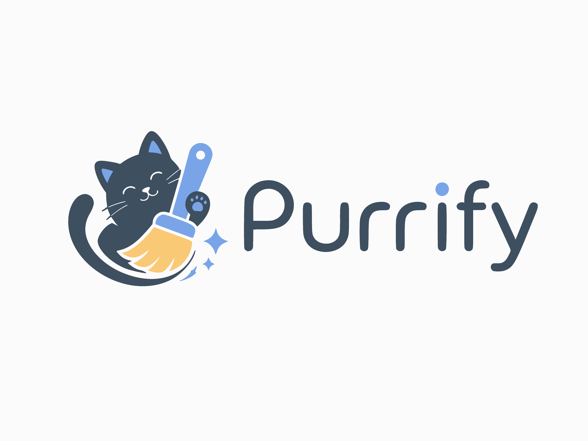
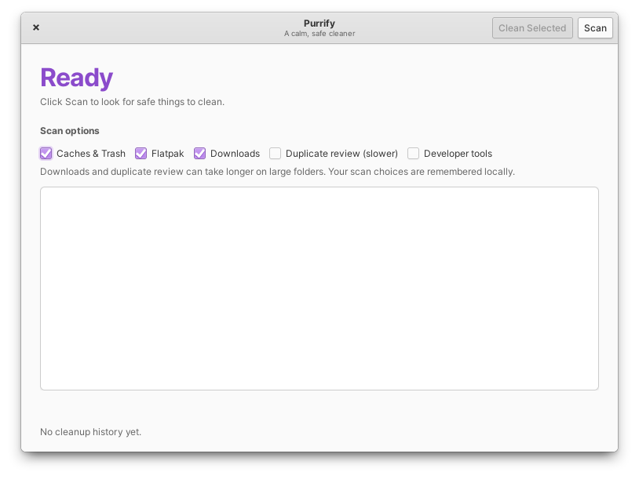
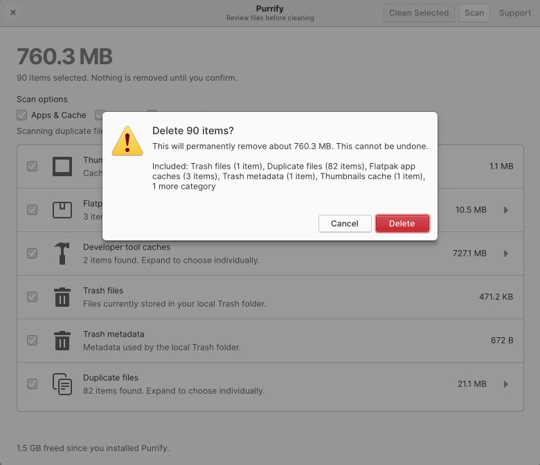
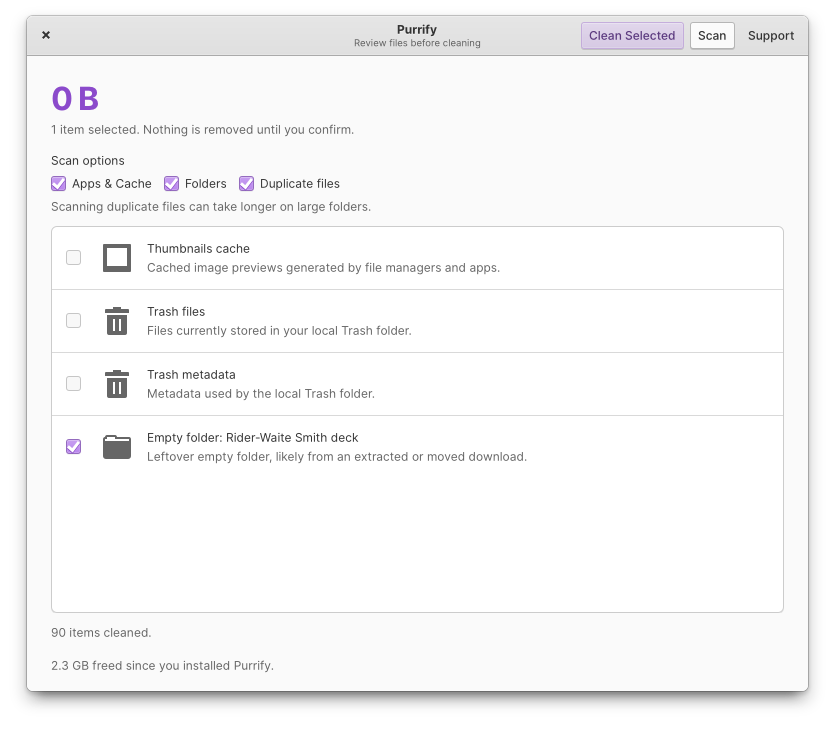

# Purrify



**Yes, the kitten cleaner.**

Purrify is a cleanup and maintenance app made for elementary OS. It reviews app caches, Trash, duplicate files, empty folders, broken shortcuts, and a few developer caches, then lets you decide what actually gets removed.

It is not a magic optimizer, and it does not pretend to know better than you. Nothing runs as root. Nothing is cleaned in the background. It scans, shows the list, and waits for you.

## Install

Install Purrify from AppCenter on elementary OS:

[](https://appcenter.elementary.io/io.github.alessandro_mattos.purrify/)

[](https://donate.stripe.com/cNicN42EFbHy54Y0P1frW00)

## Screenshots

| Ready to scan | Review cleanup targets |
|:---:|:---:|
|  |  |
| **Confirm before cleaning** | **Choose exactly what to remove** |
|  |  |

## Why

Desktop cleaners are easy to get wrong. Purrify keeps the scope narrow on purpose:

- no `sudo`
- no background daemon
- no system cleanup
- no telemetry
- no network service
- no automatic deletion
- no broad `$HOME` permission in the Flatpak manifest
- no host command permission from the Flatpak sandbox

The app only works with user-space locations that it explicitly scans, so it stays boring in the places where cleaners should be boring.

I started it after one too many "cleanup tools" made my system worse. Purrify is the version I wanted: useful, cautious, and easy to audit.

## Support the Project 🐾

If Purrify made your Linux life a little less cursed, you can **[Feed the Cat](https://donate.stripe.com/cNicN42EFbHy54Y0P1frW00)**.

Stars on [GitHub](https://github.com/alessandro-mattos/purrify) also help. Cats like attention. Developers pretend they don't, but they do.

## What It Can Review

- Apps & Cache: thumbnails, per-app crash reports, and pip, npm, and Yarn caches
- Folders: local Trash, empty folders, and broken shortcuts in common user folders
- Duplicate files: duplicate files in Downloads, matched by content hash and left unselected for review by default

## Build

Install the local development dependencies on elementary OS or Ubuntu-like systems:

```bash
sudo apt update
sudo apt install valac meson ninja-build libgtk-4-dev libgranite-7-dev libgee-0.8-dev
```

Build and run:

```bash
meson setup build --prefix=/usr/local
meson compile -C build
./build/src/purrify
```

Or use:

```bash
./scripts/dev-run.sh
```

## Flatpak

The manifest is at:

```txt
flatpak/io.github.alessandro_mattos.purrify.yml
```

Build and install locally:

```bash
flatpak-builder --user --install --force-clean build-dir flatpak/io.github.alessandro_mattos.purrify.yml
flatpak run io.github.alessandro_mattos.purrify
```

Purrify targets `io.elementary.Platform//8.2` and `io.elementary.Sdk//8.2`.

## Note

Purrify is elementary-first, but not elementary-only. It uses GTK 4, Granite, standard symbolic icons, and a Wayland-first Flatpak setup with X11 fallback.


## License

GPL-3.0-or-later. See [LICENSE](LICENSE).
